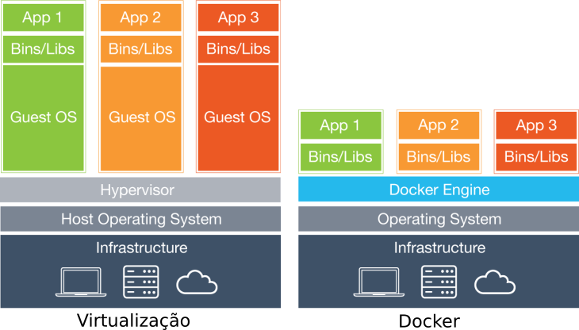
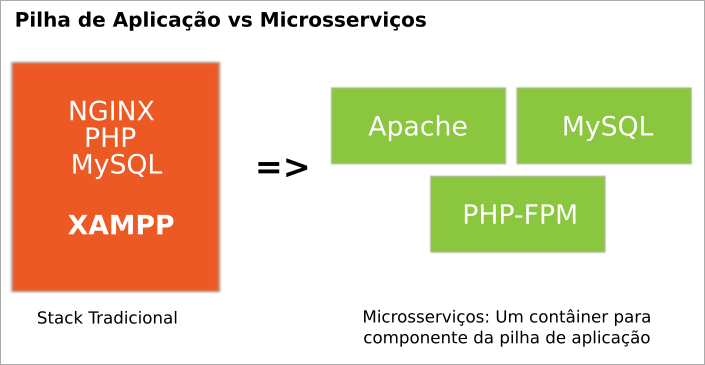
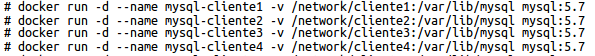
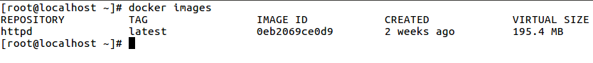
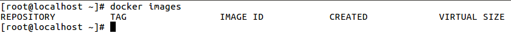
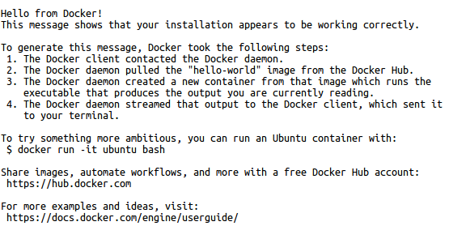
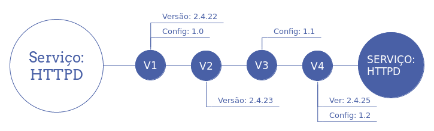

.. _aula1:

.. toctree::

============================================
Aula 1: Docker e Microsserviços - Introdução
============================================

O que é o docker?
-----------------

Docker é uma tecnologia de virtualização de processos, em que aplicações são encapsuladas em contêineres
e iniciadas como um processo isolado no sistema operacional.

Um contêiner, por sua vez, contém todas as bibliotecas necessárias para o funcionamento de uma solução específica, sendo possível ter uma variedade de contêineres com diferentes versões do mesmo software ou bibliotecas rodando em um ambiente.

O docker se diferencia **principalmente** das tecnologias de virtualização no ponto em que cada contêiner se reflete em um grupo de processos separados do sistema operacional, mas que  reproveitam a estrutura de software e hardware; por outro lado, as tecnologias de virtualização entregam desde o hardware virtual até o sistema operacional, refletido da maneira abaixo:



Dessa forma, contêineres do docker normalmente podem ser instalados em diferentes sistemas operacionais sem prejuízo de funcionamento, salvos os
casos em que a aplicação precise de algum recurso específico que não esteja presente no kernel do host em que o docker está instalado.

O que são Microsserviços?
-------------------------

Uma arquitetura de microsserviços consiste numa abordagem que enfoca o desenvolvimento e manutenção de softwares em pequenas partes, ou microsserviços, em que cada processo funciona em um contêiner distinto e se comunica através de protocolos simples, como o HTTP.

Microsserviços são um contraponto direto da distribuição de pilhas de aplicação, como pode ser visto no exemplo abaixo:



Em quais Sistemas Operacionais o Docker funciona?
-------------------------------------------------

Atualmente o Docker funciona exclusivamente em sistemas operacionais de 64 bits, especificamente:

 * Windows: Historicamente, era necessário realizar a criação de uma máquina virtual com Linux para então realizar a instalação do docker
   ou ainda utilizar o docker-machine para automatizar o processo.
   Atualmente encontra-se em testes uma versão com suporte nativo as versões Professional e Ultimate do sistema operacional (que é integrado ao Hyper-V)
   além da versão de produção que sairá em conjunto com o Windows Server 2016;

 * MacOS: Nos mesmos moldes do Microsoft Windows, mas utilizando o xhyve como virtualizador.
 
 * Linux: Qualquer versão não jurássica do Sistema Operacional: Debian 8, Ubuntu 14.04, Centos 7, Arch Linux, etc.
 
Instalação do Docker
--------------------

A instalação do Docker é um processo relativamente simples; considerando como sabor Linux as distribuições Ubuntu (16.04) e Centos (7), os passos de instalação encontram-se disponíveis em:

https://docs.docker.com/engine/installation/linux/docker-ce/centos/
https://docs.docker.com/engine/installation/linux/docker-ce/ubuntu/

A instalação consiste em adicionar o repositório docker ao sistema operacional, bem como suas dependências e instalar o pacote **docker-ce**.  

Algumas características dignas de nota são:

 * Por padrão, o gerenciamento do docker somente pode ser realizado na máquina em que foi instalado ;
 * O docker não escuta em portas tcp mas em um socket disponível /var/run/docker.sock;
 * Somente o usuário root e o grupo docker possuem acesso ao socket.

Para visualizar essas características, utilizaremos alguns comandos próprios do docker, conforme exemplos abaixo:

.. code-block:: bash

    $ docker ps
    
No exemplo acima, o retorno para o comando deve ser algo como:

``Cannot connect to the Docker daemon. Is the docker daemon running on this host?``

O que acontece provavelmente, é que o usuário atual não possui acesso ao socket em /var/run/docker.sock, 
que é URI padrão que o docker utiliza em seus comandos. Para remediar essa questão existem algumas
possibilidades:

1. Rodar o comando como root;
2. Permitir a execução do comando docker como sudo para um usuário específico;
3. Incluir o usuário no grupo 'Docker';
4. Incluir a permissão para o usuário específico no socket do Docker.

É recomendável que apenas usuários específicos possam gerenciar o docker (Mais detalhes nos capítulo relacionado a segurança).

Antes de conceder o acesso, no entanto, faremos outras verificações:

O serviço está iniciado?

.. code-block:: bash

    $ systemctl status docker.service
    
O retorno para este comando normalmente é algo como:

.. code-block:: bash

    ● docker.service - Docker Application Container Engine
       Loaded: loaded (/etc/systemd/system/docker.service; enabled; vendor preset: d
       Active: active (running) since Sáb 2016-06-18 09:08:16 BRT; 4h 25min ago


No entanto, se o serviço estiver parado, o retorno será o seguinte:
    
.. code-block:: bash

    ● docker.service - Docker Application Container Engine
       Loaded: loaded (/etc/systemd/system/docker.service; enabled; vendor preset: d
       Active: inactive (dead) since Sáb 2016-06-18 13:36:57 BRT; 2s ago

Nesse caso é necessário iniciar o serviço através do seguinte comando:

.. code-block:: bash

    # systemctl start docker.service
    
Adicionalmente, para o que docker seja iniciado durante o processo de boot do computador é necessário usar o seguinte comando:

.. code-block:: bash

    # systemctl enable docker.service


Imagens, Contêineres e seu funcionamento
----------------------------------------

Geralmente, ao se trabalhar com o Docker, passamos a tratar quase que unicamente com duas características do software: As Imagens e os Contêineres.

Uma imagem pode ser descrita como a implementação de um processo como um microsserviço; a **imagem funciona como uma fôrma** para a disponibilização potencialmente massiva desse microsserviço, cujo resultado são os contêineres. Efetivamente, ao se inserir um processo (mysql, apache, nginx, etc) na forma de uma imagem, torna-se muito simples realizar a disponibilização desses serviços.

Um exemplo a ser pensado seria a necessidade de um colaborador da empresa Y precisar disponibilizar 5 instalações de MySQL para 5 diferentes clientes; no modelo atual, o colaborador instala 5 Máquinas virtuais, as configura e, por fim, instala e configura a aplicação alvo. No Docker, por outro lado, esse mesmo colaborador teria uma imagem do software "MySQL" e faria a criação de 5 contêineres a partir do mesmo da seguinte forma:



Nesse contexto, a imagem figura como uma **matriz** que contém o MySQL e todas as ferramentas, bibliotecas e configurações necessárias para seu funcionamento previamento empacotados e cada contêiner é o serviço em si.

Imagens e Contêineres
---------------------

Como dito anteriormente, as imagens servem como fôrmas para a criação de inúmeros contêineres que irão disponibilizar os serviços desejados. Comumente, a arquitetura de uma imagem pode ser pensada (ainda que de forma simplória) da seguinte forma:

.. image:: ../data/docker-filesystems-multilayer.png

Conforme ilustrado na figura acima, uma imagem é um grupo de camadas que contém desde os software básico de um sistema operacional até os arquivos relacionados ao software que se deseja inserir na imagem. Por outro lado, o contêiner corresponde a parte volátil, ou seja, durante o funcionamento de um contêiner o gerenciamento de arquivos relacionado àquele contêiner somente se dá nessa camada, não permitindo a mudança dos arquivos relacionados a imagem.

Por conta dessa estrutura (que na verdade que é um CoW - Copy On Write) inicialmente só o espaço relacionado a imagem será gasto no sistema de arquivos; diferentemente do que acontece na virtualização convencional, 5 contêineres inicializados incorrem em uso total de espaço igual ao total da imagem (230MB por exemplo) e não 5 x 230MB. A medida que os arquivos dos contêineres forem mudando, aí sim, espaço adicional será utilizado.

Outra característica digna de nota é que, uma vez que uma imagem é criada, esta pode ser redistribuída e implantada em qualquer servidor que possua o docker instalado. 

.. note::

    A especificação acerca da imagem utilizada pelo Docker está disponível em: https://github.com/docker/docker/blob/master/image/spec/v1.md

Adquirindo Novas Imagens
------------------------

Atualmente, o docker conta com um repositório comunitário que é o **hub.docker.com**: o repositório contém imagens consideradas base (que possuem apenas o sistema operacional, utilizadas como ponto de partida para criação das imagens de aplicação), imagens oficiais das aplicações mais conhecidas (mysql, postgres, redis, etc) e imagens que são contribuições da própria comunidade.

Quando se deseja iniciar um novo contêiner precisamos, primeiramente, receber ou construir a imagem. Para saber quais imagens já estão disponíveis em um host, pode-se utilizar o seguinte comando:

.. code-block:: bash

    # docker images
    
O resultado varia de acordo com a quantidade de imagens instaladas em determinado computador, podendo ser algo como:



Ou, caso não haja imagens instaladas, o seguinte resultado:




Como pode ser visto nas figuras anteriores, uma imagem possui os seguintes atributos:

 * Repository (Repositório): Repositório de onde a imagem foi recebida. Quando uma imagem não possui um FQDN antes de seu nome (por exemplo 'postgres'), implica em dizer que essa imagem foi recebida a partir do repositório oficial do Docker, o hub.docker.com é uma imagem oficial. Outras informações no capítulo relacionado a ** tags ** posteriormente;
 * Tag: Etiqueta atribuída a uma determinada imagem. Comumente relaciona a versão do software que foi encapsulada. Ex: postgres:9.6;
 * Image Id: utilizado tanto para a verificação da imagem durante seu download quanto para identificação (além do nome).
 * Created (Data de Criação): Data de criação da imagem;
 * Size (Tamanho): Tamanho da imagem em múltiplos de Bytes (MB, GB).

Para realizar o recebimento de uma nova imagem, neste caso hospedada no site hub.docker.com, é possível utilizar o seguinte comando:

.. code-block:: bash

    # docker pull hello-world

.. note::

    O comando **docker pull** assume que a imagem será salva a partir do hub.docker.com, porém é possível ter os próprios repositórios de imagem. Mais informações acerca
    do capítulo sobre o "Registry".


Contêineres
-----------

Uma vez que já temos a imagem salva no host, basta agora realizar a criação novos contêineres a partir da mesma:

.. code-block:: bash

    # docker run hello-world


A execução do comando deve apresentar o seguinte resultado:




No entanto, se verificarmos se o contêiner ainda está em funcionamento ...

.. code-block:: bash

    # docker ps
    
Veremos que o mesmo não é mais listado dentre os contêineres em funcionamento. Para visualizarmos todos os contêineres, inclusive aqueles que não estão iniciados ou que estão com algum outro *status*, é possível utilizar o seguinte comando:

    # docker ps -a

Por que o contêiner encontra-se em estado **Parado**?

Conforme havíamos falado nos capítulos anteriores, um contêiner efetivamente disponibiliza um processo de uma aplicação; isso quer dizer que, caso a aplicação ou processo que esteja encapsulado no contêiner não esteja mais ativo ou **esteja em background**, *o próprio docker assume que aquele contêiner já executou o serviço a que se prestou e finaliza o processo*.

Um segundo exemplo, mas que mantém o contêiner funcionando seria o seguinte:

.. code-block:: bash

    # docker run -d ubuntu /bin/sh -c "while true; do echo hello world; sleep 1; done"
    
No caso acima, o contêiner executará eternamente o comando "echo hello world" ... que apesar de algo tolo, há de manter nosso contêiner em funcionamento:

.. code-block:: bash

    # docker ps

Ao iniciar o contêiner temos as mensagens de funcionamento da Aplicação, que utiliza o saída padrão no terminal atual impedindo que sejam feitas outras ações; parar o contêiner nesse caso pode ser feito através da combinação de teclas CTRL+C; o contêiner estará em um estado parado e poderá ser iniciado posteriormente de forma não interativa através do seguinte comando:

.. code-block:: bash

    # docker start <CONTAINER_ID>
    # docker start <CONTAINER_NAME>

É possível ainda definir um nome para o contêiner durante e após a sua criação, conforme exemplos abaixo:

.. code-block:: bash

    # docker run --name apache httpd:2.4
    # docker rename apache httpd24

Por fim, para remover um contêiner que esteja parado, pode-se utilizar o seguinte comando:

.. code-block:: bash

    # docker rm apache

Para a remoção de um contêiner que esteja em funcionamento pode-se utilizar o seguinte comando:

.. code-block:: bash

    # docker rm -f apache

Para aplicações é **imperativo** que estas funcionem em primeiro plano (em inglês **FOREGROUND**) para que o contêiner possa ser manter ativo e o serviço em si disponível. Um exemplo clássico é o funcionamento do Apache como um microsserviço: o comando executado no contêiner é o 'httpd -foreground', o que impede que o Apache vá para segundo plano e evitando que o contêiner seja finalizado.

.. note::

    A imagem será automaticamente baixada do repositório hub.docker.com sem a necessidade de realizar o **pull** antes quando esta não existir no servidor atual.

É possível ainda fazer a utilização de um contêiner e após a saída do processo aberto no mesmo o próprio docker pode fazer a remoção deste. Para estes casos pode-se utilizar o comando

.. code-block:: bash
	
	# docker run -it --rm debian bash

O comando acima utilizará uma imagem debian como base para criação do contêiner e abrirá um shell em modo interativo; quando da saída desse shell, através do comando exit, o contêiner será removido.

Contêineres: *Debugging* e Execução de Comandos 'Ad-Hoc' 
--------------------------------------------------------

Uma vez que um contêiner encontra-se iniciado é possível realizar o *debugging* de tarefas acessando o shell do mesmo ou enviando comandos diretamente, através do seguinte comando:

.. code-block:: bash

	# docker exec <CONTAINER> <CMD>
	# docker exec <CONTAINER> python --version

É possível ainda realizar a execução do comando em *background* através do parâmetro "-d" conforme demonstrado abaixo:

.. code-block:: bash

	# docker exec -d <CONTAINER> <CMD>

Por fim, caso o comando a ser utilizado precise de interação ou ainda um pseudo terminal, então utilizar-se-á o parâmetro '-it':

.. code-block:: bash

	# docker exec -it <CONTAINER> bash

Criação de Imagens
------------------

Para então dar prosseguimento a criação de um novo microsserviço, deve-se criar primeiramente um DockerFile, que nada mais é do que a receita para construção de uma imagem. É possível ainda gerar uma nova imagem a partir de um contêiner em funcionamento (sem um Dockerfile) transformando-o em uma imagem.

Para ilustrar o uso de um DockerFile, faremos a criação do arquivo e a construção da imagem a partir deste; para tanto, execute os seguinte passos:

 1. abra o prompt de comandos;
 2. crie uma pasta chamada "stress";
 3. acesse a pasta e crie um arquivo chamado "Dockerfile" (atenção para o "D" maiúsculo: o docker diferencia maiúsculas e minúsculas no momento da construção da imagem);
 4. Copie e cole o seguinte texto dentro do arquivo: 
 
.. literalinclude:: ../data/Stress-DockerFile


5. Salve e feche o arquivo;
6. Execute o comando "docker build -t stress ."

A diretiva final "docker build -t stress ." indica ao docker que uma imagem será construída a partir do diretório local, será etiquetada como "stress" (o que facilitará seu reconhecimento posterior), sendo que automaticamente o docker seleciona o arquivo Dockerfile no diretório atual

Para visualizar a imagem, execute novamente o seguinte comando:

.. code-block:: bash

    # docker images

Por fim, o Dockerfile é uma maneira transparente de compartilhar e averiguar a criação de uma imagem e é o método mais indicado de trabalho com o Docker.


Docker Commit
-------------

Por vezes, temos o fato de que um contêiner poder ter evoluído ao ponto de que precisa ser várias vezes configurado ou implementado, o que implica em dizer que o mesmo deverá se tornar uma imagem; casos como a necessidade de inserção de uma licença de software após a sua inicialização é um dos mais comuns para esse uso. Nesse caso pode-se realizar as mudanças no contêiner e então realizar o **commit**, o que resultará em uma nova imagem.
Quando da utilização de um commit para a criação de uma imagem, basta acessar ou criar um contêiner e realizar a configuração do mesmo como em um servidor comum. 

Para ilustrar o processo, iniciaremos através da criação de um contêiner com base em Debian, cujo comando a ser executado será o shell Bash:

.. code-block:: bash

    # docker run -it debian bash
    
Uma vez dentro do novo contêiner, podemos iniciar a configuração do contêiner:

.. code-block:: bash

    # apt-get update && apt-get install wget -y
    # exit
    
Ao sair do contêiner, o mesmo estará **parado**, pois o comando bash foi finalizado. Antes do commit será necessário saber o ID do mesmo:

.. code-block:: bash

    # docker ps -a
    
Com ID em mãos, resta apenas criar uma nova imagem a partir do mesmo, através do seguinte comando:

.. code-block:: bash

    # docker commit <ID> myimage:latest


.. note::

    Imagens criadas através de commits tem uma rastreabilidade e capacidade de reprodução muito baixas; algumas soluções no entanto tentam retornar quais comandos foram utilizados para a criação de uma imagem, como por exemplo em: https://github.com/CenturyLinkLabs/dockerfile-from-image.

Gerenciamento de Imagens
------------------------

Além da criação e aquisição de novas imagens, o docker permite o gerenciamento daquelas presentes no host do docker.

A listagem das imagens presentes no host atual pode ser feita da seguinte forma:

.. code-block:: bash

    # docker images

A opção de remoção é uma das mais comuns; para remoção de uma imagem, desde que a mesma não esteja em uso por algum contêiner, pode-se utilizar o seguinte comando:

.. code-block:: bash

    # docker rmi <ID>
    # docker rmi <NAME>:<TAG>
    
Por fim, é possível definir uma *etiqueta/tag* para uma imagem existente através do comando *docker tag*:

.. code-block:: bash

    # docker tag centos:7 default-so:latest
    
Um outro ponto importante é o de que, a medida que as imagens e novas versões destas são baixadas, é necessário monitorar o espaço em disco utilizado pelas imagens, principalmente aquelas que não são mais utilizadas como base para nenhum contêiner ("stale"); para esse caso, atualmente há duas boas opções (USE COM CUIDADO):

1. Spotify-GC: Spotify GC é um contêiner que quando inicializado verifica todos os contêineres parados e imagens não utilizados a faz a remoção destes;
2. Docker Prune: através do comando `docker system prune` é possível recuperar espaço utilizados por imagens, contêineres e volumes do Docker.

.. note::
    Note que para as soluções que fazem a remoção de imagens *stale*, caso um contêiner esteja parado este será removido, mesmo que o motivo da parada tenha sido algum problema de software! Por conta desse fato, recomenda-se utilizar com bastante cautela qualquer uma das soluções apresentadas.
    
Principais instruções para criação de imagens
---------------------------------------------

Pode-se dizer que em 95% dos casos as seguintes diretivas são utilizadas em um Dockerfile:

 * ADD: Adiciona um arquivo ou diretório do sistemas de arquivo local para a imagem;
 * COPY: Copia arquivos remotos e/ou locais para a imagem.
 * CMD: Comando padrão a ser executado pela imagem;
 * ENTRYPOINT: Permite configurar o contêiner ou apenas definir o comando a ser executado (Sobrepõe o CMD);
 * ENV: Define variáveis de ambiente;
 * EXPOSE: Informa ao docker que uma porta da rede do contêiner está disponível;
 * FROM: Inicia a imagem a partir de outra imagem: Ex "FROM debian:8";
 * RUN: Roda um comando no sistema operacional da imagem;
 * ARG: Define variáveis de ambiente, mas permite que no momento da construção da imagem seja passado o valor para a variável específicada. Útil para quando se deseja permitir que o usuário construa imagens para mais de uma versão do mesmo software usando o mesmo DockerFile.
 
Para ilustrar o uso de cada uma dessa diretivas, visualizaremos o arquivo a seguir:

.. literalinclude:: ../data/Semaphore-Dockerfile

No exemplo acima, temos as seguintes definições:

1. A imagem é baseada na imagem "gcavalcante8808/ansible";
2. Muda-se o contexto para o usuário root (nesse caso, equivale a 'su');
3. Um arquivo da internet é baixado e inserido no contêiner pelo Docker sem a necessidade de instalação de pacotes de clientes Web como curl ou wget;
4. Alguns comandos são lançados no bash;
5. O arquivo "semaphore.sh" é copiado da pasta atual para dentro do contêiner;
6. Muda-se o contexto para o usuário webserver (sem privilégios administrativos);
7. Define-se uma variável de ambiente chamada "GIN_MODE" com o valor "release"  (aplicações em Go que utilizam o framework GIN verificam essa variável para saber o modo de operação a ser inicializado);
8. O diretório de trabalho/inicial é definido para "/home/webserver";
9. A diretiva EXPOSE informa ao Docker quais são as portas em que o contêiner comumente escuta;
10. O *EntryPoint* para este contêiner será o script anteriormente copiado.
 
.. note::

    A instrução "EXPOSE" não faz a publicação da porta, sendo hoje uma boa prática para facilitar a visualização de quais portas do contêiner deveriam estar abertas no momento de sua execução.
    Instruções sobre cada uma das diretivas de construção podem ser vistas em: https://docs.docker.com/engine/reference/builder

Diferenças entre RUN, ENTRYPOINT e CMD
--------------------------------------

Muitas vezes, durante a confecção de um Dockerfile, a utilização das diretivas *RUN*, *ENTRYPOINT* e *CMD* parecem de certa forma nebulosas, pois estes parecem funcionar da mesma maneira. Para tentar esclarecer essa dúvida, pensemos da seguinte forma:

 * RUN: Utilizado para rodar um comando dentro do contêiner, não é utilizado para definição do comando principal a ser executado pelo contêiner;
 * CMD: Pode ser utilizado como comando principal a ser executado pelo contêiner;
 * ENTRYPOINT: Pode e deve ser utilizado como comando principal a ser executado pelo contêiner.
 
A grande diferença aqui, na realidade, é que:

Quando existe um ENTRYPOINT e um CMD no mesmo DockerFile, os valores definidos na diretiva CMD se tornam **parâmetros** para o ENTRYPOINT, conforme o exemplo abaixo:

```
FROM centos:7
ENTRYPOINT ["ls"]
CMD ["-lha"]
```

No caso acima, o entrypoint seria o comando `ls` e o CMD passaria o `-lha` como parâmetro para o entrypoint. Os casos mais comuns para utilização desse tipo é quando um determinado binário possui mais de uma função ou subcomando. Alguns exemplos:


Dicas para criação de imagens
-----------------------------

Algumas dicas para a criação de imagens podem fazer com que tanto o tamanho final, quanto a complexidade destas diminuam potencialmente. Algumas das dicas são:


Sempre criar um diretório a parte para então realizar a edição do Dockerfile dentro do diretório
^^^^^^^^^^^^^^^^^^^^^^^^^^^^^^^^^^^^^^^^^^^^^^^^^^^^^^^^^^^^^^^^^^^^^^^^^^^^^^^^^^^^^^^^^^^^^^^^


    Durante o tempo de construção da imagem, todos os arquivos presentes no diretório são copiados para o **contexto** da imagem, que contribui para o tamanho final da mesma e permite que sejam utilizados através das diretivas *ADD* e *COPY*


Sempre utilizar um arquivo .dockerignore
^^^^^^^^^^^^^^^^^^^^^^^^^^^^^^^^^^^^^^^^

    
    Para evitar que pastas ou arquivos indesejados sejam copiados para dentro do contexto, crie um arquivo .dockerignore (no mesmo diretório do Dockerfile) contendo as pastas e arquivos (1 por linha) que serão ignorados no momento da construção da imagem.

 
Procure reduzir o número de camadas aninhando vários comandos RUN
^^^^^^^^^^^^^^^^^^^^^^^^^^^^^^^^^^^^^^^^^^^^^^^^^^^^^^^^^^^^^^^^^

    Um erro comum dentre aqueles que estão iniciando no docker é utilizar uma diretiva *RUN* para cada comando que desejam que seja executado; ao invés disso é desejável que sempre que possível, vários comandos estejam aninhados em uma só diretiva *RUN*:
    
    RUN apt-get update && apt-get install wget -y


Apt-get e Yum se mal utilizados aumentam e muito o tamanho das imagens
^^^^^^^^^^^^^^^^^^^^^^^^^^^^^^^^^^^^^^^^^^^^^^^^^^^^^^^^^^^^^^^^^^^^^^
    
    Arquivos de listas e caches desses gerenciadores de pacotes comumente aumentam muito o tamanho de uma imagem. Após instalar os pacotes necessário procure remover todos os arquivos criados por eles que não serão mais necessários.
    
    Para o APT, utiliza-se a seguinte sintaxe:
    
    RUN apt-get update && \\
        apt-get install wget -y && \\
        rm -rf /var/lib/apt/lists/* /tmp/* /var/tmp/* && \\
        apt-get clean
    
    Para o Yum, utiliza-se a seguinte sintaxe:
    
    RUN yum install httpd -y && \\
        yum clean all


Jamais utilize Apt-get Upgrade ou Yum Upgrade
^^^^^^^^^^^^^^^^^^^^^^^^^^^^^^^^^^^^^^^^^^^^^

    As imagens base do docker são regularmente atualizadas para que incluam as últimas versões dos pacotes (as vezes saem mais de uma imagem por semana). Jamais faça um 'upgrade' usando as ferramentas de pacotes.


Jamais instale o SystemD padrão nas imagens base
^^^^^^^^^^^^^^^^^^^^^^^^^^^^^^^^^^^^^^^^^^^^^^^^

   As imagens base contém a versão cloud do systemd, muito menor que o systemd original, sendo que estas são mutuamente exclusivas.


Ciclo de vida de Contêineres
----------------------------

Diferentemente das soluções tradicionais de TI, o ciclo de vida de um contêiner acaba no momento em que é necessário realizar a atualização do mesmo (versão da aplicação, configuração, etc): o contêiner antigo deve ser removido e um novo criado baseado na imagem atualizada. A image abaixo pode auxiliar na elucidação do processo:



Esse é mais dos motivos pelo qual se prega que os contêineres devem refletir a arquitetura de microsserviços: a atualização de cada componente de uma pilha de aplicação torna-se muito mais simples, considerando que cada componente pode ser atualizado em separado; também promulga as boas práticas de evitar **configuration drift** entre os vários contêineres, organizando e padronizando o ambiente de TI.

