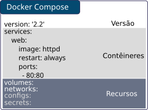

.. _aula2:

.. toctree::

*****************************************************
Aula 2: Docker: Persistência de Dados e Configurações
*****************************************************

Sistema de Arquivos dos Contêiners 
----------------------------------

Os sistemas de arquivos utilizados pelos contêiners são, comumente, reflexos do sistema de arquivos do host organizado por uma tecnologia de **UnionFS** e que suporta o conceito de **COW - Copy On Write**, organizando o sistema de arquivos em várias camadas com diferentes versões de arquivos e se apresentando de forma consolidada ao contêiner. 

No caso das imagens, cada diretiva utilizada no momento de sua construção resulta em uma camada adicional no sistema de arquivos; isso permite que diferentes imagensreutilizem os dados de diretiva em comum além de**compartilhar as camadas existentes e evitar o uso adicional/intensivo de disco**, conforme ilustrado na imagem abaixo:

.. image:: ../data/container-layers.jpg

Assim, as camadas relativas à imagem permanecem inalteradas ao passo que uma camada relativa a um contêiner continua a ser alterável; no entanto, por conta da forma de funcionamento do **UnionFS**, o conjunto excessivo de operações de escrita na camada relativa a um contêiner devem ser evitadas, pois incorrem em diferentes níveis de perda de *throughput*.

.. warning::

    Todos os arquivos editados e/ou salvos no sistema de arquivos de um contêiner são perdidos quando da remoção do mesmo.

Após a criação de um contêiner, é possível visualizar quais dados que residem no sistema de arquivos do mesmo foram mudados, adicionados ou removidos, através do comando `docker diff <CONTAINER>`:

.. image:: data/docker_diff.png

No exemplo acima, há adições "A" e mudanças "C"; para remoções o *status* seria indicado pela letra "D" no início da linha.

Volumes e Tipos de Montagem
---------------------------

Ao contrário do sistema de arquivos do contêiner, que são removidos quando da exclusão do mesmo, os **volumes** são áreas de dados **persistentes**, normalmente diretórios do sistema de arquivos do *host* ou de um *storage* disponibilizados  para um contêiner, de forma análoga a montagem de volumes que ocorre nos sistemas operacionais UNIX. Ao contrário dos sistemas de arquivos dos contêineres, volumes **não sofrem** *overheads* de escrita e também não são perdidos (a menos que se utilize o parâmetro -v na remoção do contêiner) com a exclusão/criação de contêineres, pois o acesso ao sistema de arquivos do volume é direto.

Existem 3 tipos de montagem de volumes que podem ser utilizados:

 * *Bind*: Utiliza-se uma pasta presente no host que será montada em um alvo específico dentro do contêiner. Simplista, esse modo de montagem é muitas vezes utilizado para facilitar o acesso aos arquivos do volume;
 * *Volume*: Comumente referido como **Named Volume**, utiliza-se a infraestrutura de volume do docker, que pode tanto utilizar drivers locais para servir o espaço para o contêiner, quanto utilizar plugins que permitem fazer a integração com outros serviços como o Amazon S3, Minio, CEPH, etc;
 * *TmpFS*: Análogo ao tmpfs de sistemas posix, permite reservar uma área de memória para montagem em um contêiner, sendo útil para dados que possuem um alto nível de mutabilidade mas que não precisam persistir em caso de remoção do contêiner.

.. note::

    Existe ainda um sub-tipo, que seria um volume anônimo, criado como volume e um *guid* quando da inicialização de um contêiner que contenha a diretiva *VOLUME* mas que durante a sua criação não tenha sido incluído a montagem de um volume.

Para realizar a montagem de um volume em um contêiner, pode-se utilizar o parâmetro "--mount type=bind,source=/diretorio,target=/montagem" durante a execução do comando `docker run`, como no exemplo abaixo:

.. code-block:: bash

    # docker run -d --mount type=bind,source=/data,target=/tmp/data httpd

No exemplo acima a pasta "/diretorio" será *montada* dentro do endereço "/pontodemontagem" do contêiner.

.. note::
    
    Caso a pasta a ser montada no contêiner não exista, a mesma será criada no sistema de arquivos. 
    

Adicionalmente também é possível realizar a montagem em modo somente-leitura adicionando a diretiva ":ro" ao final da declaração:

.. code-block:: bash

    $ docker run -d --mount type=bind,source=/data:/tmp/data:ro httpd:alpine

.. note::

    Um comportamento muito importante por parte dos volumes é o de que, se o volume estiver vazio, mas a pasta originalmente do contêiner possuir arquivos, estes serão copiados para o volume. 
    **Para os demais tipos de montagem, esse comportamento não ocorre.**

Named Volumes
^^^^^^^^^^^^^

O *named Volume* é um volume inicializado durante a criação do contêiner e gerenciado pelo próprio Docker, sendo utilizado nas seguintes situações:

 1. Quando da utilização de plugins do docker para suporte a volumes (NetApp, Convoy, etc);
 2. Padronização dos volumes no ambiente.
 
A criação de um *named volume* normalmente ocorre através do seguinte comando:

.. code-block:: bash
    
    $ docker volume create --driver local --name volume1

Após a criação de um volume, a lista com todos os volumes pode ser visualizada através do seguinte comando:

.. code-block:: bash

    $ docker volume ls

A utilização do volume por um contêiner possui sintaxe parecida com a montagem de volumes do sistema de arquivos, conforme pode ser visualizado abaixo:

.. code-block:: bash

    $ docker run -d --name postgres-default --mount type=volume,source=volume1,target=/var/lib/postgresql/data postgres:alpine

A remoção de um *named volume* pode ser realizada através do seguinte comando:

.. code-block:: bash

    $ docker volume rm volume1

.. note::

    A remoção de um volume só poderá se dar quando da não utilização do mesmo por um contêiner.

Por fim, é possível visualizar a utilização de espaço em disco para *named volumes* através do comando `docker system df -v`, que irá mostrar os espaço utilizados por volumes, imagens, contêineres e, para os recursos não utilizados, a percentual de espaço que pode ser recuperado.

Docker Compose
==============

O *Docker Compose* é uma ferramenta para definição e inicialização de arquiteturas multi-container do docker. Com o compose, o administrador/desenvolvedor descreve a arquitetura e
configuração de cada um dos contêineres e a relação entre eles em um arquivo do tipo "YAML" chamado **docker-compose.yml**.

O conjunto de definições disponível é o mesmo que seria relativo ao conjunto de opts/parâmetros na criação de um contêiner a partir do comando `docker run`; em verdade,
a medida em que o docker evolui e passa a disponibilizar novas opções, o docker-compose também evolui afim de permitir que novos parâmetros possam ser usados para realizar
a definição de novos conjuntos de microsserviços e suas configurações.

.. note::

    Uma visão geral das versões suportadas pelo docker compose em relação ao docker pode ser vista em https://docs.docker.com/compose/compose-file/compose-versioning/#compatibility-matrix

Antes de iniciar a utilização do docker-compose, é necessário realizar a instalação através dos seguintes comandos:

.. code-block:: bash

    # sudo curl -L https://github.com/docker/compose/releases/download/1.20.1/docker-compose-`uname -s`-`uname -m` -o /usr/local/bin/docker-compose
    # sudo chmod +x /usr/local/bin/docker-compose

.. note::

    O Docker-compose é uma aplicação feita em Python, que também pode ser instalada via pip através do comando `pip install docker-compose`.

A seguir, realizamos a criação de uma aplicação simples com o framework *Flask*, em um arquivo chamado "app.py" contendo as seguintes diretivas:

.. literalinclude:: ../data/flask-app.py

Na continuação, criamos o Dockerfile relacionado a essa nova aplicação:

.. literalinclude:: ../data/dockerfile-flask

Após a instalação do mesmo, é necessário criar o arquivo **docker-compose.yml** que conterá todas as instruções necessárias para levantamento dos contêineres. 

A estrutura de um arquivo docker-compose.yml, pode ser descrita da seguinte maneira:

Perceba que o arquivo se inicia com a definição da versão do docker-compose; neste caso 2.2, pois pode incluir apenas os recursos necessários para funcionamento dos serviços/contêineres em modo *standalone*, ou seja, não se aplica aos recursos específicos de cluster do docker.

Um exemplo de declaração válido está disponível abaixo:

.. literalinclude:: ../data/docker-compose-django.yml

.. warning::

    Arquivos dos tipo YAML se baseam na **indentação** dos itens para leitura das definições de arquivos. Assim sendo, recomenda-se a utilização de espaços para indentação ao invés de tabulações.

O arquivo anteriormente disponibilizado representa de forma simples, a seguinte relação:

Após a criação do arquivo docker-compose.yml, basta iniciar o conjunto de contêineres com o seguinte comando:

.. code-block:: bash

    $ docker-compose up -d

Perceba que o docker-compose utiliza automaticamente o nome da pasta "recipiente" para a geração dos nomes dos contêineres; assim, o contêiner relativo ao serviço "db" passaria a ser "django_db_1" caso o nome da pasta fosse "django" e o contêiner da aplicação se chamaria "django_web_1". O número após o nome do contêiner permite ao compose controlar a quantidade de contêineres a serem criados para o "serviço" (o que dá o suporte a escalonamento).

Com os contêineres foram criados através do compose, é também possível gerenciá-los usando o docker-compose, conforme exemplos abaixo:

.. code-block:: bash

    $ docker-compose stop
    $ docker-compose start
    $ docker-compose restart
    $ docker-compose stop && docker-compose rm
    $ docker-compose logs

Perceba que cada comando é executado sobre todos os contêineres presentes no docker-compose.yml; por fim, para remover o conjunto de contêineres pode-se utilizar o comando `docker-compose down`.

Para realizar o "escalonamento" dos serviços, pode-se utilizar o comando "docker-compose scale" seguido do nome do serviço e número de "réplicas":

.. code-block:: bash

    $ docker-compose scale web=3

Assim, após a execução do comando supracitado, seriam criados os contêineres "django_web_2" e "django_web_3".

.. note:: 

    Diferentemente dos recursos de cluster, o docker-compose scale apenas cria novos contêineres para os serviços definidos dentro do arquivo docker-compose.yml, sendo o escopo do docker-compose local, ou seja, a criação de contêineres sempre ocorre apenas no host atual. 

Definição de Volumes e uso de recursos já existentes
-----------------------------------------------------------

Além da definição de contêineres de forma propriamente dita, outros recursos como redes e volumes também podem ser definidos através de um arquivo do docker-compose. O exemplo abaixo contém exemplos de definição de redes e volumes:

.. literalinclude:: ../data/docker-compose.netvol.yml

No exemplo acima, temos um *named volume* chamado "data" e uma rede chamada "databases" que, considerando a pasta recipiente "zabbix", resultará na criação da rede "zabbix_databases" e do volume "zabbix_data" respectivamente.

Para o caso em que se deseja utilizar recursos previamente existentes, desde contêineres a redes pode-se utilizar a diretiva "external: true" conforme exemplo abaixo:

``
  volumes:
    myvol:
      external: true
``

Considera-se como "external" quaisquer recursos que não serão gerenciados a partir do arquivo docker-compose.yml atual; podem ser recursos de qualquer espécie como volumes criados manualmente, redes, dentre outros.

A utilização de recursos de ambos os tipos (gerenciados e não gerenciados pelo compose) pode ser descrita da seguinte maneira:

``
    volumes:
      db:
        external: false
      backup:
        external: true
``

Docker Compose: Composição de configurações
-------------------------------------------

Por fim, o docker-compose suporte a composição de configurações ou *overrides*, de modo que um arquivo docker-compose.yml pode servir de base para a configuração de um serviço e demais arquivos podem conter as especificidades a serem implementadas; em verdade, esse tipo é configuração é comum para casos em que se possui múltiplos ambientes, tais como desenvolvimento, homologação e produção.

Os requisitos para a composição de configurações através dos arquivos do docker-compose são:

 * O arquivo de override ou definido pelo usuário precisa iniciar com o mesmo *version* do arquivo docker-compose.yml;
 * Os serviços a serem configurados precisam ser aqueles já definidos no arquivo docker-compose.yml.

Por padrão, todas as configurações presentes em um arquivo "docker-compose.override.yml" são automaticamente lidos e aplicados pelo docker-compose no momento de sua execução; é possível ainda definir arquivos com nomes específicos que poderão ser analisados e aplicados pelo docker-compose.

O exemplo abaixo denota dois arquivos: o docker-compose.yml padrão e o docker-compose.override.yml:

.. literalinclude:: ../data/docker-compose-django.yml

.. literalinclude:: ../data/docker-compose-django.override.yml

No exemplo acima, no momento da execução do comando "docker-compose up -d", seria criado um volume chamado "django_pgdata" que seria utilizado como volume para guardar os dados do serviço "db", exemplificando uma possível guarda dos dados do banco de dados em um volume do storage netapp (possivelmente essa seria uma configuração de produção), além da aplicação das demais definições do arquivo docker-compose original.

A utilização de arquivos com nomes definidos pelo usuário (usualmente congruente aos ambientes de execução dos serviços) é plenamente suportada, bastando para tanto especificar a *flag* -f no momento de execução do docker-compose:

.. code-block:: bash

    # docker-compose up -f docker-compose.devel.yml -d
    # docker-compose up -f docker-compose.homolog.yml -d
    # docker-compose up -f docker-compose.prod.yml -d

Sendo que no caso acima, cada arquivo conteria as configurações adequadas ao ambiente no qual estaria sendo executado.

.. note::

    O docker-compose sempre cria uma nova rede "default" e adiciona aos contêineres definidos no arquivo docker-compose.yml.

.. note::

    Mais informações acerca das diretivas do compose disponíveis em: https://docs.docker.com/compose/
