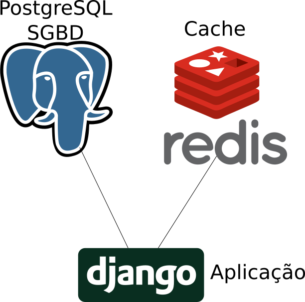
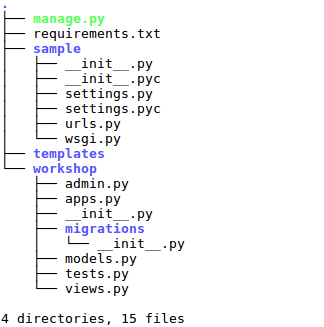

.. _aula2_exercises:

.. toctree::

*******
Cenário
*******

Uma aplicação que hoje está instalada diretamente em um servidor e que deverá convergir para o modelo de contêineres, possui a seguinte estrutura:

Desejando melhorar e aplicar os conceitos de encapsulamento através de contêineres, são traçadas as seguintes necessidades:

1. O contêiner de banco de dados deve ser o do PostgreSQL em sua última versão, que deve possuir um schema chamado 'workshop', cujo usuário é o 'workshop' e a senha desse usuário é 'workshop123'.

Além disso, os dados devem ser persistidos na pasta local do host, preferencialmente em /home/unise/workshop/pgdata e o contêiner deve se chamar "workshop-db".

2. A aplicação utiliza-se de um servidor Redis como seu cache, servidor esse chamado "workshop-redis".

3. A imagem de aplicação deve possuir acesso ao contêiner 'workshop-redis' e 'workshop-db'. Sua estrutura de diretórios é a seguinte:

Com isso em mente, a imagem da aplicação a ser criada deve-se utilizar de uma imagem base que possua o python em sua última versão e atenda aos seguintes requisitos:

 #. Ter o pip instalado;
 #. Antes de instalar as dependências da aplicação, será necessário instalar as bibliotecas de sistema necessárias para seu funcionamento;
 #. As dependências da aplicação deverão ser instaladas através do pip;
 #. Antes de funcionar de forma propriamente dita, a aplicação precisa popular o banco de dados com a estrutura necessária para seu funcionamento através de *migrations*;
 #. É necessário criar pelo menos um usuário com acesso ao sistema. Isso só pode ser feito de maneira **interativa**;
 #. O comando para a inicialização da aplicação é: ``python manage.py runserver 0.0.0.0:8000``.

Informações adicionais acerca da aplicação
##########################################

Para auxiliar os executores do processo, as seguintes informações são repassadas:

**Item 1**: Usualmente a seguinte diretiva é suficiente para instalar o PIP:

.. code-block:: bash
    
    # curl https://bootstrap.pypa.io/get-pip.py | python

**Item 2**: Para este projeto, as seguinte bibliotecas do sistema operacional são suficientes:

 * gcc
 * libpq-dev (ou similar correspondente às bibliotecas de desenvolvimento dos postgres).

**Item 3**: Projetos python possuem normalmente um arquivo requirements.txt que contém as dependências de bibliotecas da aplicação. Usualmente, o pip pode ler e instalar essas dependências **caso a aplicação já tenha sido copiada para dentro da imagem**:

.. code-block:: bash

    # pip install -r requirements.txt

**Item 4**: Um comando da própria aplicação pode gerenciar o banco de dados e gerar as estruturas do banco dados:
 
.. code-block:: bash

    # python manage.py migrate --no-input

**Item 5**: Um comando da própria aplicação pode realizar a criação desse usuário, mas precisa ser iniciado de forma **interativa**:

.. code-block:: bash
 
    # python manage.py createsuperuser

**Com base nos dados acima dispostos, realize o processo completo de encapsulamento de toda a pilha de infraestrutura e aplicação no modelo de contêineres.**

Como Verificar se todas as ações ocorreram conforme o esperado
##############################################################

Acesse a página "/admin" do conteiner na porta 8000 (Eg. http://172.100.0.2:8000/admin) e faça o login utilizando o usuário de aplicação criados nos passos anteriores.