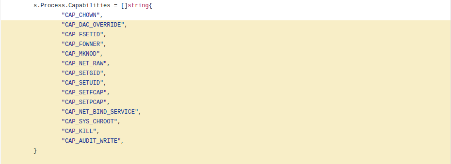

.. _aula3:

.. toctree::

*********************************
Aula 3: Gerenciamento e Segurança
*********************************

===============
Docker Registry
===============

O Docker Registry provê um serviço para hospedagem de imagens do Docker análogo ao que está disponível no hub.docker.com, porém com a possibilidade de uso e hospedagem em uma rede interna.

Para iniciar um novo contêiner com o registry utilize o seguinte comando:

.. code-block:: bash

    # mkdir /root/registry && cd /root/registry
    # docker run -d -p 5000:5000 --restart=always -v /root/registry/data:/var/lib/registry --name registry registry:2

Antes de enviar ou receber imagens a partir do novo registry, será necessário configurar o docker para permitir a interação entre o cliente e o registry. Nesse caso, inicie a edição da configuração do docker com o seguinte comando:

.. code-block:: bash

    # systemctl edit --full docker

Na linha que se inicia com **ExecStart** adicione os seguintes parâmetros:

    ``--insecure-registry=myregistry.com:5000``

E por fim reinicie o docker para aplicar as configurações:

.. code-block:: bash

    # systemctl restart docker
    
Para verificar quais *insecure registries* são aceitos pelo daemon do docker, utilize o comando "docker info"; a informação desejada estará ao final do comando, abaixo da linha que se inicia com "Insecure Registries:".

Uma vez que o docker está preparado, realizar o envio de uma imagem requer que **você defina tags nas imagens atuais que contenham o nome do repositório no formato registry:porta/imagem:tag** e faça o *push*, conforme o exemplo abaixo:

.. code-block:: bash

    # docker tag ubuntu myregistry:5000/ubuntu:yak
    # docker push myregistry:5000/ubuntu:yak

Realizar o download de imagens a partir do registry é igualmente fácil:

.. code-block:: bash

    # docker pull myregistry:5000/ubuntu:yak
    
No entanto, até então, toda a comunicação com o registry vem sendo realizada através de HTTP, ou seja, sem a criptografia da comunicação. Para ativar o suporte a TLS/HTTPS no acesso a aplicação, crie um certificado, remova o contêiner antigo e proceda da seguinte maneira:

.. code-block:: bash

    # mkdir -p /root/registry/certs
    # cp domain.* /root/registry/certs
    # docker run -d -p 5000:5000 --restart=always \
      -v /root/registry/data:/var/lib/registry \
      -v /root/registry/certs:/certs \
      -e REGISTRY_HTTP_TLS_CERTIFICATE=/certs/domain.crt \
      -e REGISTRY_HTTP_TLS_KEY=/certs/domain.key \
      --name registry registry:2

.. note::

    Para fins de aprendizado, o certificado pode ser gerado através do site http://www.selfsignedcertificate.com/. Para o ambiente de produção, solicite os certificados junto a área de infraestrutura.
    

É possível ainda fazer a restrição de acesso ao registry através da utilização de credenciais no estilo htpasswd. Para tanto, procesa da seguinte maneira:

.. code-block:: bash

    # cd /root/registry && mkdir auth
    # docker run --entrypoint htpasswd registry:2 -Bbn testuser testpassword > auth/htpasswd
    # docker run -d -p 5000:5000 --restart=always \
      -v /root/registry/data:/var/lib/registry \
      -v /root/registry/certs:/certs \
      -v /root/registry/auth:/auth \
      -e REGISTRY_HTTP_TLS_CERTIFICATE=/certs/domain.crt \
      -e REGISTRY_HTTP_TLS_KEY=/certs/domain.key \
      -e "REGISTRY_AUTH=htpasswd" \
      -e "REGISTRY_AUTH_HTPASSWD_REALM=Registry Realm" \
      -e REGISTRY_AUTH_HTPASSWD_PATH=/auth/htpasswd \
      --name registry registry:2

Para realizar o login na registry, utilize o "docker login", conforme abaixo:

.. code-block:: bash

    # docker login myregistry.enterprise.com:5000

.. note::

    As informações de login são guardadas como *base64* no arquivo ~/.docker/config.json.
    

Por fim, a criação do contêiner do registry pode ser refletida com o seguinte *compose file*:

 .. literalinclude:: ../data/docker-compose-registry.yml

.. note::

    Mais informações acerca do registry podem ser encontradas em: https://docs.docker.com/registry/configuration/

==================================================
CGROUPS: Gerenciamento de Recursos dos Containeres
==================================================

É possível direcionar o uso de recursos do ambiente a cada contêiner durante a sua criação ou funcionamento.

Para tanto, o próprio recurso de CGroups contém descritores para cada tipo de recurso: CPU, Memória, Throughput de Disco e *Rede. O número desses descritores atribui um peso/prioridade para cada contêiner, sendo que por padrão, todos os contêineres dividem os recursos disponíveis igualmente.

A definição da limitação de recursos podem acontecer durante a criação do contêiner, com parâmetros em conjunto com o comando "docker run" ou através após a criação do contêiner (inclusive durante seu funcionamento) utilizando-se o comando "docker update".

.. note ::

    O gerenciamento/escalonamento da pilha de rede de um contêiner não é suportado pelo docker.
    Informações completas acerca  do docker update disponíveis em: https://docs.docker.com/engine/reference/commandline/update.
    

CPU
---

O controle de uso de CPU por contêiner pode ocorrer em 3 níveis:

 * Afinidade de processos;
 * Peso Relativo;
 * Porcentagem de Uso do Recurso.
 
Para o caso de peso relativo, leva-se em conta que cada contêiner possui até 1024 descritores, o que define o uso mínimo do recurso de CPU. O exemplo abaixo ilustra a criação de um contêiner que possui a pelo menos a 25% da CPU:

.. code-block:: bash
    
    # docker run -it --rm --cpu-shares 256 stress --cpu 1

A seguir criamos um contêiner que não possui configuração de uso da CPU, ou seja, sem faixa mínima de uso:

.. code-block:: bash
    
    # docker run -it --rm stress --cpu 1

Nesse caso, para um uso proporcional de 10% do sistema operacional, o primeiro contêiner ficaria com uso de algo em torno de 20%, enquanto o segundo utilizaria o restante da CPU.

No caso da definição da afinidade de um contêiner basta indicar as CPU's alvo através do parâmetro "--cpuset-cpus", conforme abaixo:

.. code-block:: bash

    # docker run -it --rm --cpuset-cpus=0,1 stress --cpu 2

Por fim, para definir o uso de recursos de um contêiner, deve-se utilizar o parâmetro "--cpuset-quota":

.. code-block:: bash

    # docker run -it --rm --cpu-quota=50000 stress --cpu 4
    
No caso acima, o contêiner estará limitado a utilizar até 50% do total de processamento do sistema; como nesse caso não houve a definição de afinidade o provável comportamento será o aparecimento de 4 processos, com ~13% de uso de cpu cada.

.. note ::

    Demais informações acerca do controle de uso via quota para a CPU disponíveis em: https://www.kernel.org/doc/Documentation/scheduler/sched-bwc.txt
    
Memória
-------

O gerenciamento de uso do recurso de memória para um contêiner pode se dar em três níveis:

 * Quantidade de Memória RAM;
 * Quantidade de Uso de Swap;
 * ** Reserva de Memória **.

Para definir a quantidade de memória RAM que um determinado contêiner pode utilizar, adiciona-se o parâmetro "--memory" seguido da quantidade e unidade:

.. code-block:: bash

    # docker run -d --memory=1G --name httpd httpd
    # docker update --memory=512M httpd

É possível ainda definir o valor de swap que um contêiner pode usar, mas é necessário que seja em conjunto com o valor de memória RAM, conforme exempo abaixo:

    # docker run -d --memory=1G --memory-swap=2G --name httpd httpd
    # docker update --memory 1G --memory-swap 2G httpd

A **reserva de memória** (que funciona na prática como um **soft limit**) funciona de forma que, quando o ambiente estiver saturado, o docker tentará fazer com que contêiner alvo utilize o valor de memória definido. Vide o exemplo abaixo:

    # docker run -d --memory 1G --memory-swap=2G --memory-reservation 100M --name httpd httpd

É interessante notar que, por padrão, o próprio Docker interromperá o funcionamento de um contêiner caso ele chegue ao topo de uso definido ou utilize toda a memória do sistema. A sintaxe para desabilitar o **oom-killer** para um determinado contêiner é:

.. code-block::  bash

    # docker run -it --rm -m 200M --oom-kill-disable ubuntu:16:04

.. warning::

    É possível desabilitar esse comportamento para um contêiner, porém isso só é recomendável para o caso em que ele possua um limite de RAM; desabilitar o **OOM-KILLER** para um contêiner que não possui um limite definido poderá fazer com que o Administrador do servidor precise matar os processos do host manualmente para liberar memória.

Uso de Disco - **Throughput**
-----------------------------

O gerenciamento de uso do Disco para um contêiner pode se dar em três níveis:

 * Peso Relativo;
 * Escrita e Leitura em bps (incluindo múltiplos);
 * Escrita e Leitura em Operações por segundo (IOPS).
 
A gerenciamento de recursos de disco através do docker somente funcionará de facto caso o Scheduler de IO do Kernel seja o CFQ. Para descobrir o scheduler em uso, utilize o seguinte comando:

.. code-block:: bash

    # cat /sys/block/sda/queue/scheduler
    
Caso o scheduler não esteja definodo como CQF, utilize o seguinte comando para realizar a mudança:

.. code-block:: bash

    # echo cfq > /sys/block/sda/queue/scheduler

Para a definição de uso de recurso através do peso relativo, deve-se levar em conta os valores de 100 (mínimo, maior restrição) a 1000 (máximo, sem restrições). Para visualizar os resultados do teste a seguir será necessário abrir dois terminais; o primeiro conterá um contêiner cujo parâmetro **--blkio-weight** será 100 e o segundo 600. Os comandos a serem inseridos em cada terminal são:

.. code-block:: bash

    # docker run -it --rm --blkio-weight 600 fedora sh -c 'time dd if=/dev/zero of=test.out bs=1M count=512 oflag=direct'
    # docker run -it --rm --blkio-weight 100 fedora sh -c 'time dd if=/dev/zero of=test.out bs=1M count=512 oflag=direct'
    
É possível ainda realizar a configuração do peso relativo para dispositivos específicos do sistema operacional. Esse tipo de controle é útil para os casos em que os arquivos do contêiner ficam em um determinado ponto de montagem enquanto que os volumes ficam outro. Exemplo:

.. code-block:: bash

    #docker run -it --rm --blkio-weight-device "/dev/vdb:500" fedora sh -c 'time dd if=/dev/zero of=/mnt/rede/test.out bs=1M count=512 oflag=direct'

.. note::

    Assim como no caso do peso relativo da CPU, a "limitação" do uso somente ocorrerá caso outro processo ou contêiner não esteja a fazer uso intensivo do I/O.
    

.. note::

    Se ambos os parâmetros forem especificados ("--blkio-weight" e "--blkio-weight-device"), o primeiro passa a ser o padrão para o contêiner enquanto o segundo

.. warning::

    Mudar o **IO Scheduler** do Sistema Operacional pode ter consequências indesejáveis em algumas aplicações ou contêineres. Verifique junto ao fabricante da solução alvo possíveis problemas que podem ser causados quando do uso do CFQ como **IO Scheduler **.
    
A seguir, quando da utilização do gerenciamento via  **Escrita e Leitura em bps**, torna-se possível definir valores tanto para escrita quanto para a leitura. Os parâmetros utilizados para tanto são, respectivamente, "--device-read-bps" e "device-write-bps", que são utilizados em conjunto com o dispositivo ao quais os contêiner possuem acesso. Veja os exemplos abaixo:

.. code-block:: bash

    # docker run -it --rm --device-write-bps /dev/sda:10mb fedora sh -c 'time dd if=/dev/zero of=test.out bs=1M count=512 oflag=direct'
    # docker run -it --rm --device-read-bps /dev/sda:10mb fedora sh -c 'time dd if=/dev/zero of=test.out bs=1M count=512 oflag=direct'

Por fim, é possível também realizar o gerenciamento de recursos baseados em operações por segundo (leitura ou escrita):

.. code-block:: bash

    # docker run -it --rm --device-write-iops /dev/sda:20 fedora sh -c 'time dd if=/dev/zero of=test.out bs=1M count=512 oflag=direct'

=========
Segurança
=========

Além do fato dos processos serem isolados através de *CGROUPS*, o docker dispõe ainda do uso de outros mecanismos disponíveis em um kernel Linux tais como:

 * Posix Caps: disponível a partir da versão 2.2, posix capabilites são divisões unitárias de permissões que um superusuário possui, que sendo atreladas a um binário, evitam a necessidade de uso do root ou bit de execução como outro usuário(setuid e setgid) . Ex: Utiliza-se apenas CAP_SYS_CHROOT para usar um chroot e CAP_SYS_NICE para mudar o prioridade de um processo ao invés de dar acesso como 'root' via setuid;
 * Seccomp: *Securing Compute Mode* é um recurso do kernel linux que permite restringir as chamadas do Kernel que podem ser executadas por um processo,
 * Apparmor: Módulo de segurança que tem por objetivo proteger o sistema operacional das aplicações. Comumente, o AppArmor possui um *profile* relacionada a cada aplicação a ser rodada com ações permitidas e proibidas. Padrão para o sistema Ubuntu e possui suporte disponível no Debian através da instalação do pacote de mesmo nome;
 * Selinux: *Secure Enhanced linux* ou *Selinux* é um módulo de segurança do Kernel que possui o mesmo objetivo do AppArmor: proteger o sistema operacional de ações danosas das aplicações. Padrão nas distribuições RedHat e seus derivados.

**O Docker já trabalha com configurações de PCACPS, SecComp e AppArmor/Selinux por padrão em todas as imagens, pois já trás vários desses *profiles* junto com sua instalação padrão.**

Posix Capabilities
------------------

O docker, por padrão, permite apenas uma pequena fatia de capabilities por padrão, como pode ser visto abaixo:

Capabilities são adicionadas ou removidas de um contêiner no momento de sua criação:

.. code-block:: bash

    # docker run --cap-drop=NET_RAW --rm fedora bash

No exemplo acima, mesmo como root, não é possível utilizar o comando 'ping', pois o contêiner não possui a capability CAP_NET_RAW.

.. note::

    Uma lista completa de *capabilities* pode ser vista em ``man capabilities``.

https://docs.docker.com/engine/security/seccomp/

Docker: Plugins de Autorização
==============================

Para fins de autorização, o docker suporta\* três métodos:

 #. Permissões do Socket Docker;
 #. Permissões de um proxy reverso que faça o *forwarding* da chamada de API para o endpoint tcp do docker;
 #. Suporte a plugins de autorização.

Por padrão, somente o usuário root possui acesso ao socket do docker, que fica disponível em ``/var/run/docker.sock``. Isso acontece pelo fato de que, a partir do momento que um usuário possui acesso ao socket ele pode instrospectar
informações acerca dos contêineres e até mesmo gerenciá-los ... criando, exemplo, contêineres com acesso privilegiado no ambiente do host. Por esse motivo, recomenda-se que o acesso ao arquivo de socket seja controlado afim de prover
um nível mínimo de auditabilidade do ambiente.

Da mesma forma, é possível fazer com que o docker passe a aceitar requisições através de TCP em sua API Rest; nesse caso, o docker **não** provê nenhuma forma de controle; em verdade, a partir do momento em que há conectividade para o endpoint do Docker, basta
enviar as requisições HTTP's para realizar o gerenciamento do mesmo. Usualmente nesses casos, utiliza-se um proxy reverso antes da API Do docker (que nesse caso só é acessível através do endereço de localhost), que possui algum método de autenticação/autorização configurado
e que, uma vez satisfeito pelo usuário, dá acesso ao gerenciamento do Docker como um todo.

Por padrão, o Docker não vem configurado para permitir o acesso via TCP, sendo necessário adicionar o seguinte parâmetro a configuração do serviço:

``
    ExecStart= [...] -H 127.0.0.1:2375
``

.. note::

    A API do Docker pode ser configurada para operar via TLS/HTTPS para melhoria da segurança; mais informações disponíveis em: https://docs.docker.com/engine/security/https/

Por fim, é possível realizar a criação de um **plugin** proverá a parte de autenticação e autorização, que funcionará da seguinte forma:

.. image:: ../data/authz_allow.png

.. image:: ../data/authz_deny.png

.. note::

    Informações de criação de plugins de autorização e autenticação estão disponíveis em: https://docs.docker.com/engine/extend/plugins_authorization/

