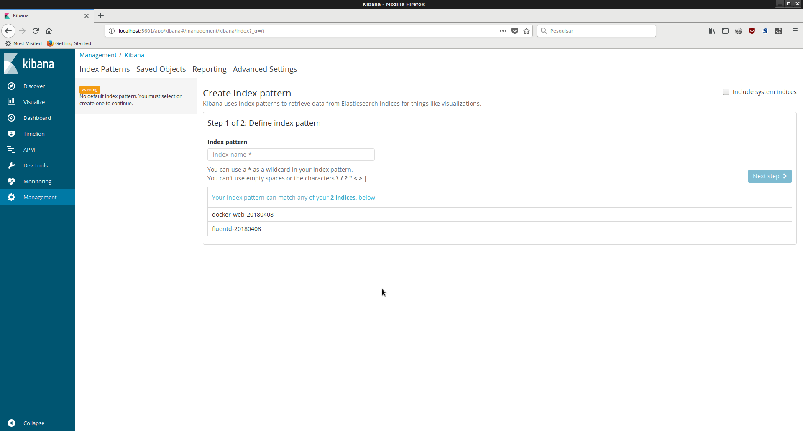
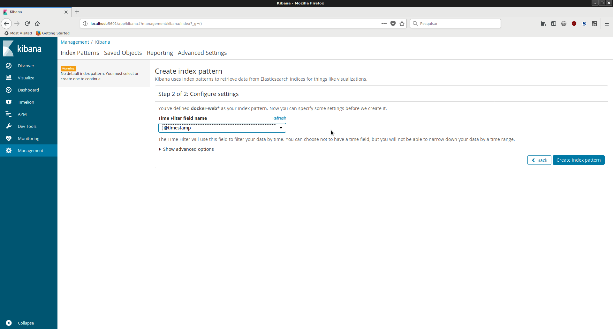
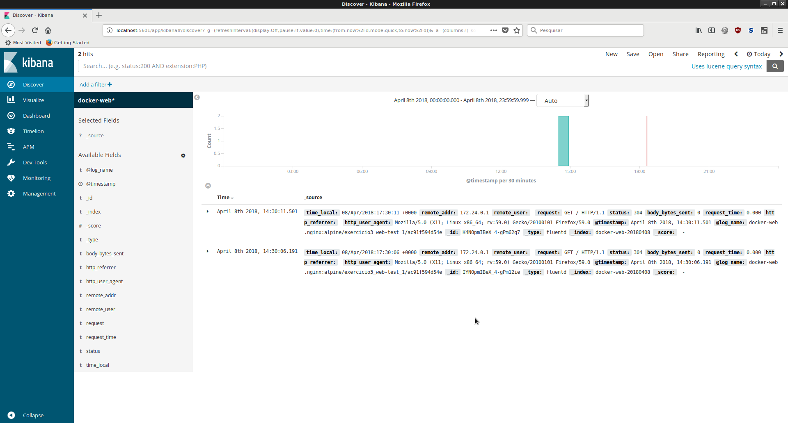

.. _aula3_exercises_3:

.. toctree::

***************************************************************************
Cap. 3 - Exercício 3: Centralização e Visualização dos Logs dos Contêineres
***************************************************************************

Para aplicar os conhecimentos explanados nesta aula, será necessário implementar um conjunto de soluções e integrações para guarda de logs de um contêiner de teste plenamente funcional. Para tanto, as ações abaixo balizam a implantação de um *stack* utilizando fluentd (coleta/recepção), elasticsearch (guarda) e Kibana (Visualização):

1. Remover o contêiner do fluentd previamente criado através do comando ``docker-compose down``;
2. Como root, rodar o comando ``sysctl -w vm.max_map_count=262144`` necessário para funcionamento do ElasticSearch;
3. Criar uma nova pasta chamada "logs" e insira o seguinte conteúdo para o arquivo docker-compose.yml:

.. literalinclude::  app/docker-compose.yml

4. Criar uma pasta chamada "fluentd" dentro da pasta "logs" e, nela, criar o arquivo Dockerfile com o seguinte conteúdo:

.. code-block:: yaml

    FROM fluent/fluentd
    RUN gem install fluent-plugin-elasticsearch --no-rdoc --no-ri

5. Ainda na pasta "fluentd", proceda com a criação de um arquivo chamado "fluent.conf" contendo as seguintes configurações:

.. literalinclude:: app/fluentd/fluent.conf

5. Criar um arquivo chamado "nginx.conf" na pasta "logs", contendo as seguintes configurações:

.. literalinclude:: app/nginx.conf

5. Inicializar os contêineres através do comando ``docker-compose up -d``. Nesse ponto, o elasticsearch e o Kibana podem demorar de 1 a 2 minutos para serem inicializalidos a depender da configuração de hardware do host;
6. Realizar algumas requisições HTTP para o endereço ``http://localhost:8082`` afim de que logs sejam gerados e enviados ao fluentd e elasticsearch;
7. Acessar o Kibana através de um browser no endereço ``http://localhost:5601`` e clicar no item "Patterns", conforme figura abaixo:

8. No campo index pattern, incluir o valor "docker-web*" e em seguinte clicar no botão "Next Step";
9. Na tela seguinte, no campo "Time Filter field name", escolher a opção "@timestamp", conforme figura abaixo:

10. Por fim, basta visualizar os logs gerados clicando no item de menu "Discover" no painel lateral. A visualização há de ocorrer de forma parecida com a da figura abaixo:

Salvando os trabalhos
---------------------

Após a realização das atividades, salve o resultado do trabalho no github, através dos seguintes comandos (a partir da pasta onde os trabalhos se encontram):

.. code-block:: bash

    # Adicionar os arquivos atuais ao repositório
    git add .
    # Realizar o 'Commit' das mudanças no repositório local.
    git commit -m "Aula 3 - Exercicio 3"
    # Criar uma etiqueta para esta aula.
    git tag -a aula3_3 -m "Aula 3 - Exercicio 3"
    # Enviar as mudanças para o repositório remoto.
    git push -u origin master aula3_3

