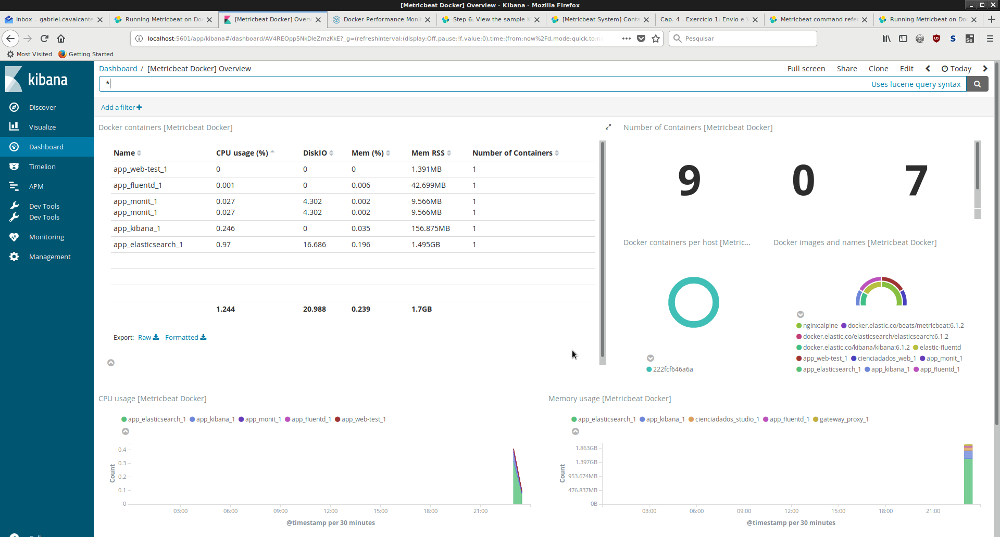

.. _aula4_exercises_1:

.. toctree::

*************************************************************************
Cap. 4 - Exercício 1: Envio e Visualização de Métricas via Beats e Kibana
*************************************************************************

Para aplicar os conhecimentos explanados nesta aula, será necessário implementar um conjunto de soluções e integrações para guarda das métricas de funcionamento dos contêineres.

Para tanto, a estrutura relativa ao exercício do Capítulo 3: Centralização e Visualização dos Logs dos Contêineres, precisará estar funcionando, pois o MetricBeat será conectado a rede anteriormente criada ("logs_default") e utiliza o ElasticSearch para realizar a guarda das coletas/métricas.

As ações abaixo balizam a implantação de um *stack* utilizando Elastic Beats (coleta), elasticsearch (guarda) e Kibana (Visualização):

1. Criar uma nova pasta chamada "monit"  e inserir o seguinte conteúdo para o arquivo docker-compose.yml:

.. code-block:: yaml

    version: '2.2'
    volumes:
      beats-data:
        
    services:
      monit:
        image: docker.elastic.co/beats/metricbeat:6.1.2
        volumes:
         - beats-data:/usr/share/metricbeat
         - /var/run/docker.sock:/var/run/docker.sock
         - ./metricbeat.yml:/usr/share/metricbeat/metricbeat.yml
         - /proc:/hostfs/proc:ro
         - /sys/fs/cgroup:/hostfs/sys/fs/cgroup:ro
         - /:/hostfs:ro
         
        networks:
         - logs_default

    networks:
      logs_default:
        external: true

2. Criar o arquivo de configuração do MetricBeat, chamado ``metricbeat.yml`` conforme definições abaixo:

.. code-block:: yaml

    metricbeat.config.modules:
      path: /usr/share/metricbeat/modules.d/*.yml
      reload.enabled: true

    processors:
    - add_cloud_metadata:

    output.elasticsearch:
      hosts: ['elasticsearch:9200']

    setup.kibana:
      host: "kibana:5601"

3. Inicializar os contêineres através do comando ``docker-compose up -d``;
4. Ativar o módulo responsável pelo monitoramento das métricas dos contêineres através do seguinte comando:

.. code-block:: bash

    $ docker-compose exec monit metricbeat modules enable docker

5. Se a api do Docker funcionar somente via socket, será necessário ajustar a permissão do socket no **host**, da seguinte forma:

.. code-block:: bash

    $ sudo setfacl -m u:1000:rwx /var/run/docker.sock

6. A seguir, atualizar as configurações do Kibana para incluir as estruturas necessárias para recebimento das métricas e os *dashboards/visualizações*:

.. code-block:: bash

    $ docker-compose exec monit metricbeat setup

7. Por fim, deve-se realizar o acesso ao kibana no endereço ``http://localhost:5601`` e, em seguida, clicar no item "DashBoards", link " [Metricbeat Docker] Overview ", que deverá resultar na seguinte visualização:

Salvando os trabalhos
---------------------

Após a realização das atividades, salve o resultado do trabalho no github, através dos seguintes comandos (a partir da pasta onde os trabalhos se encontram):

.. code-block:: bash

    # Adicionar os arquivos atuais ao repositório
    git add .
    # Realizar o 'Commit' das mudanças no repositório local.
    git commit -m "Aula 4 - Exercicio 1"
    # Criar uma etiqueta para esta aula.
    git tag -a aula4_1 -m "Aula 4 - Exercicio 1"
    # Enviar as mudanças para o repositório remoto.
    git push -u origin master aula4_1

